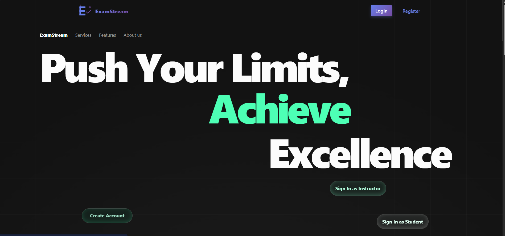
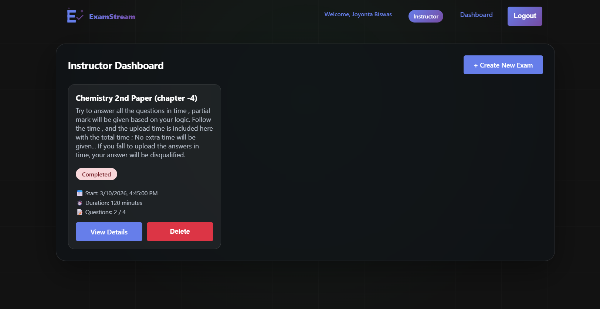
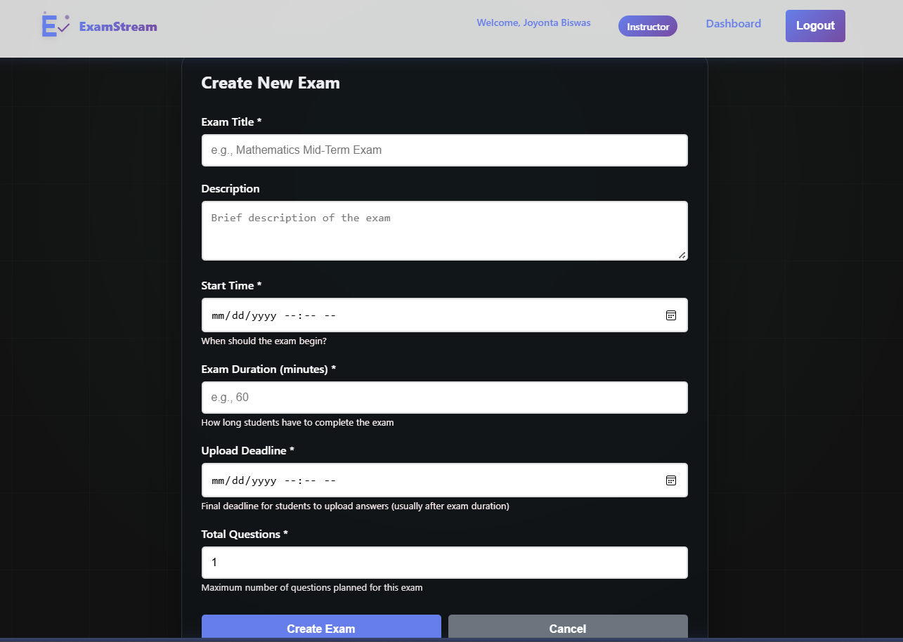
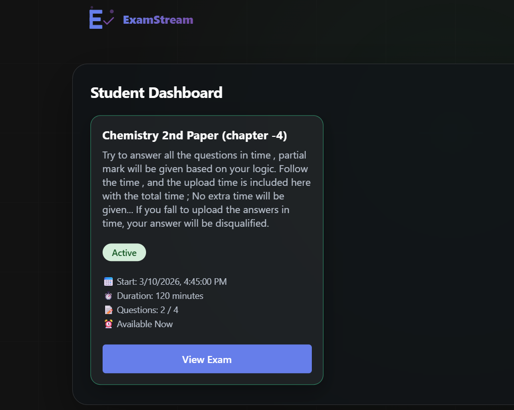
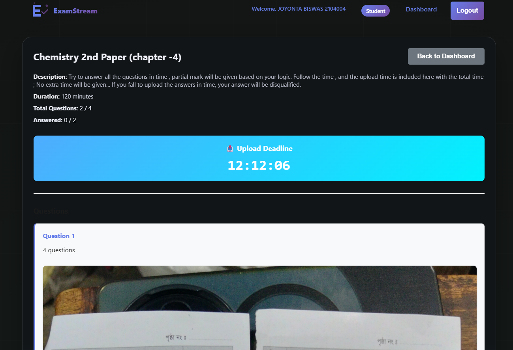
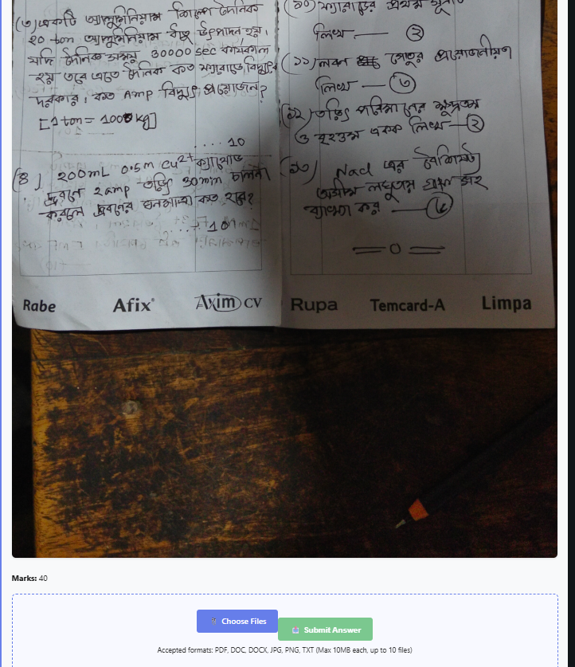

# ExamStream - Online Exam Platform

ExamStream is a MERN stack web application for running online exams with timed windows, secure student uploads, and instructor-focused exam management.

## About This Project

ExamStream is a full-stack platform I built to make online exams less chaotic.

One place for exam setup, clear timers, and reliable student submissions. Instructors can manage assessments through a single dashboard, while students get a focused flow from exam start to final upload.

Through this project, I strengthened practical skills in React, Node.js, Express, and MongoDB, while implementing real-world workflows such as role-based authentication, deadline-driven actions, and cloud file handling.

## Highlights

- Instructor dashboard to create exams, add questions, and manage timelines
- Student dashboard to join exams, upload answers, and submit on time
- Timer-based flow for start time, duration, and upload deadline
- Cloud file handling through Cloudinary and optional Google Drive integration
- Automated transactional emails using Brevo (signup and account status)
- Role-based authentication with JWT

## Screenshots

```text
screenshots/home-page.png
screenshots/instructor-dashboard.png
screenshots/create-exam.png
screenshots/student-dashboard.png
screenshots/take-exam1.png
screenshots/take-exam2.png
```








## Tech Stack

- Frontend: React, React Router, Axios
- Backend: Node.js, Express
- Database: MongoDB Atlas
- Storage: Cloudinary
- Email: Brevo (API and SMTP fallback)
- Auth: JWT

## Quick Start

### 1. Install all dependencies

```bash
npm run install-all
```

### 2. Create backend environment file

Create `backend/.env` and add:

```env
PORT=5000
MONGODB_URI=your_mongodb_atlas_connection_string
JWT_SECRET=your_secret_key_here

# Cloudinary
CLOUDINARY_CLOUD_NAME=your_cloudinary_name
CLOUDINARY_API_KEY=your_cloudinary_key
CLOUDINARY_API_SECRET=your_cloudinary_secret

# Brevo email (recommended: configure API and SMTP)
BREVO_API_KEY=your_brevo_api_key
BREVO_SMTP_USER=your_brevo_login_email
BREVO_SMTP_KEY=your_brevo_smtp_key
EMAIL_FROM=your_verified_sender_email
EMAIL_TIMEOUT_MS=30000

# Frontend API URL (optional for local)
FRONTEND_URL=http://localhost:3000
```

## Email Configuration (Brevo)

- The backend first tries Brevo API if BREVO_API_KEY is configured.
- If API key is missing, it falls back to Brevo SMTP using BREVO_SMTP_USER and BREVO_SMTP_KEY.
- For production hosting, API mode is more reliable when SMTP ports are restricted.
- If no Brevo credentials are provided, email features remain disabled.

### 3. Run the app

```bash
npm run dev
```

- Frontend: http://localhost:3000
- Backend: http://localhost:5000

## Deployment

### Backend (Render)

1. Push code to GitHub.
2. Create a new Render Web Service.
3. Connect with repository.
4. Add backend environment variables.
5. Deploy.

### Frontend (Vercel)

1. Import the same repository.
2. Use build command: `cd frontend && npm install && npm run build`
3. Use publish directory: `frontend/build`
4. Add `REACT_APP_API_URL` with your deployed backend URL.
5. Deploy.

## Project Structure

```text
ExamStream/
|-- backend/
|   |-- config/
|   |-- middleware/
|   |-- models/
|   |-- routes/
|   |-- services/
|   `-- server.js
|-- frontend/
|   |-- public/
|   |-- src/
|   `-- package.json
|-- screenshots/
`-- README.md
```

## Notes

If you want to collaborate or report an issue, open a GitHub issue in this repository.
